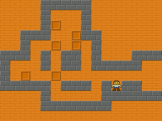
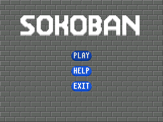
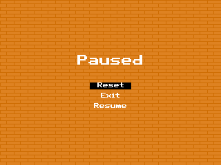
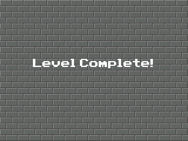

# Sokoban for the TI-84 plus CE

## Installaton

Send `bin/SOKOBAN.8xp` (program) and `side_scripts/SOKOLVLS.8xv` (levels) to your calculator. Both are required for the program to function.

## Controls

Use `2nd`, `Enter`, arrow buttons, `mode`, and the `cos` key.

Use arrows to navigate menus and move player

Use `2nd` and arrows to scroll viewport in-game.

use `cos` to enter teacher mode (a look-alike of the home screen) and clear to exit. This can be triggered at any point in the program.

Use `mode` to enter debug mode from the home screen. There is normally no reason to use this, but it was usefull for me during development. Mode also pauses the game.

## Game rules

push the boxes on to all the goal spots to complete the level. You cannot pull on boxes.

## Levels

I got the in-game levels from [this repo](https://github.com/davidjoffe/sokoban/).

## notes
A small portion of the code for this project was suggested or written by AI.

This is my first real coding project, so please do not judge my horrible code.

The `side-scripts` folder contains some python code used to generate the level appVar.

All feature suggestions are welcome but I may not get to implementing them.

Made with the [CE C/C++ Toolchain](https://github.com/CE-Programming/toolchain/releases).

## screenshots

